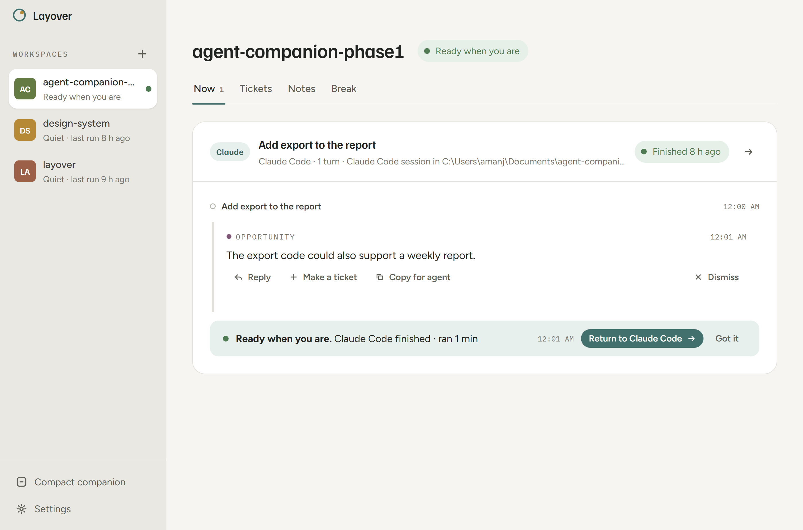
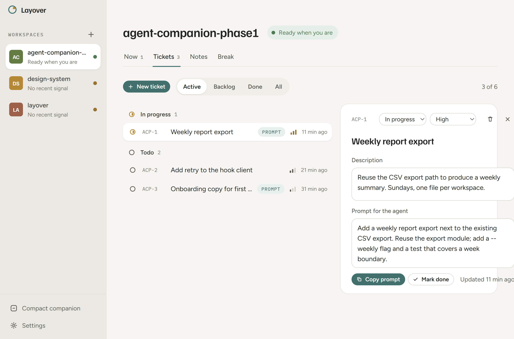
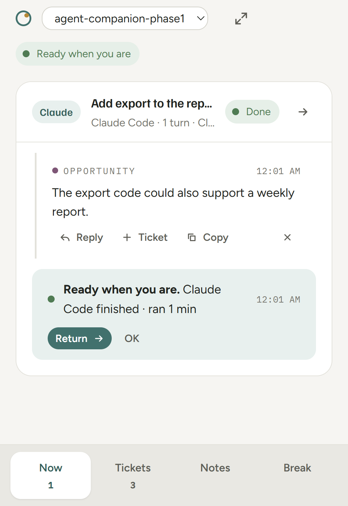

# Layover

**Layover is a companion for the time your coding agent is working.** When Claude Code or Codex starts a turn in a project folder, Layover opens that project beside you — what the agent decided, what it needs from you, what you'll do next, and a break if you want one. When the turn ends, it says so and gets out of the way.

It makes **no model calls** and runs entirely on your machine: an Electron app hosting a loopback service, a small CLI that agents call, and lifecycle hooks that report start and finish.

Windows and macOS.

## Install

One command. It downloads the latest release, installs per-user, connects Claude Code and Codex, and opens the app.

Windows (PowerShell):

```powershell
irm https://raw.githubusercontent.com/amanjaiman/layover/main/scripts/install.ps1 | iex
```

macOS:

```bash
curl -fsSL https://raw.githubusercontent.com/amanjaiman/layover/main/scripts/install.sh | sh
```

Then start an agent in any project folder — Layover opens that workspace. (The macOS build is unsigned; the script clears the quarantine flag so Gatekeeper lets it run.)

Everything the app's buttons do is also a command: `layover setup --agent all`, `layover setup --agent claude --remove`, `layover status`.

### Updating

Layover checks GitHub for a newer release every few hours — the only request it makes off your machine, and switchable off in Settings → Preferences → Updates. When one exists, **Layover x.y.z available** appears in the sidebar and the tray menu; **Install and restart** swaps in the new version, reconnects the hooks, and reopens.

### Manual install (Windows)

1. Run `release/Layover-Setup-<version>.exe` (per-user, no admin). It installs to `%LOCALAPPDATA%\Programs\layover`, adds a Start Menu entry, and on first launch puts `layover` on your user PATH.
2. Layover opens. Click **Connect** for Claude Code and/or Codex. That writes:
   - the `layover` skill to `~/.claude/skills/layover/` and `~/.agents/skills/layover/`
   - lifecycle hooks to `~/.claude/settings.json` and `~/.codex/hooks.json` (merged; nothing else touched)
3. Codex asks you to trust new hooks once: type `/hooks` inside Codex and approve the Layover entries. Claude Code needs nothing more.

Uninstall from Windows Settings, or run `Uninstall Layover.exe`. Your data in `%LOCALAPPDATA%\Layover` is kept unless you delete it. Run `layover setup --remove` first if you want the agent hooks gone.

## What it does

Four views, one per thing you do while an agent works. `Ctrl+1…4` switches between them.



**Now** — one thread per agent conversation, Slack-style. The header shows the agent, what it's working on, and its status. The timeline carries each turn plus the *Decisions*, *Input requested*, *Opportunities* and *Think ahead* items the agent left along the way.

- A **Waiting on you** chip appears only when the agent is genuinely stopped — a permission prompt, or an item it marked as blocking.
- **Reply inline.** Your message reaches the agent at its next pause (after a tool call, as the turn ends, or with your next prompt), and the thread shows when that happened.
- Proposals can be pushed to Next; anything can be dismissed. Threads quiet for 30 minutes archive themselves, and can be restored any time.



**Next** — what you'll do after this. Linear-style underneath, calm on the surface: In progress, Up next, Someday, Done, Dropped. Each entry has a key like `LAY-12`, a priority, a description, and a **prompt draft**.

- *Copy prompt* packages the title, description and draft for the agent, key included.
- Start a turn with that key in the prompt and the entry moves itself to In progress; the thread shows the key and offers *Mark done* when the turn finishes.
- `n` or `Ctrl+N` creates one. The key prefix is yours to set (Settings → Workspace).

**Notes** — the project's running notes. Autosaved, with conflict protection.

**Break** — stretch prompts, a timer, and optional reminders; it can suggest a break or start one once you stop typing.

### Around the views

- **Workspaces** (left rail) — one per project folder, with a colour, a name, and a dot that breathes marigold while an agent works. Switching never loses your place or your unfinished writing.
- **Return to the agent** — brings forward the window the session started in (terminal, VS Code, the Claude desktop app), recorded by the hook at session start. If it's gone, you get the session details and a copyable resume command.
- **Compact companion** (`Ctrl+Shift+C`) — the same app at 400×580, floating. On macOS it also lives in the menu bar as a popover that closes when you click away.
- **Keyboard** — `n` new in Next, `r` reply to the latest item, `j`/`k` through Next, `e` edit, `Esc` close, `[` collapse the sidebar, `?` for the full list.
- **Focus** — the start of a turn is the one moment Layover comes forward, because you just pressed Enter and are waiting. Items and completions never move the window. Settings → *When an agent starts a turn* offers: come forward (default), open behind my work, only if already open, stay quiet.

<p align="center"></p>

## How agents reach it

**Hooks (deterministic).** `UserPromptSubmit` starts a run; `Stop` ends it as completed, `StopFailure` as failed, `Interrupt`/`SessionEnd` as cancelled. Claude's `Notification` hook turns permission prompts into "Input requested" items. Each prompt hook prints one short line so the agent knows its run id. No model reasoning is involved in lifecycle.

**Skill (voluntary).** The `layover` skill tells the agent when a decision, question, or opportunity is worth a `layover item` call — and when to stay silent. Publishing is one shell call per item, at the moment it becomes true.

**CLI.**

```
layover item --run <id> --kind decision --text "Chose email sign-in; continuing."
layover begin --agent claude --path C:\work\site --title "Build onboarding"   # for sessions without hooks
layover end --run <id> --status completed
layover open --path C:\work\site
layover state | status | setup | help
```

The packaged CLI runs on the app's own Node runtime, so you don't need Node installed.

## Development

```
npm install            # Node 22+; then approve electron's postinstall if npm asks
npm test               # store, hooks, setup, HTTP service
npm start              # dev app (data in %LOCALAPPDATA%\Layover unless LAYOVER_DATA is set)
npm run dist           # release/Layover-Setup-<version>.exe
```

Use `LAYOVER_DATA` and `LAYOVER_PORT` together to run an isolated instance. The dev CLI is `bin\layover.cmd` (uses `node`); `layover setup` from a checkout points hooks at that path. Releases are built by the GitHub workflow on a tag push (`git tag v0.5.0 && git push --tags`); macOS artifacts come from a macOS runner.

- [docs/ARCHITECTURE.md](docs/ARCHITECTURE.md) — the pieces and the event contract
- [docs/CAPABILITIES.md](docs/CAPABILITIES.md) — what has been verified live and what has not
- [docs/DESIGN-AUDIT.md](docs/DESIGN-AUDIT.md) — the audit that drove 0.3.1, with the open questions
